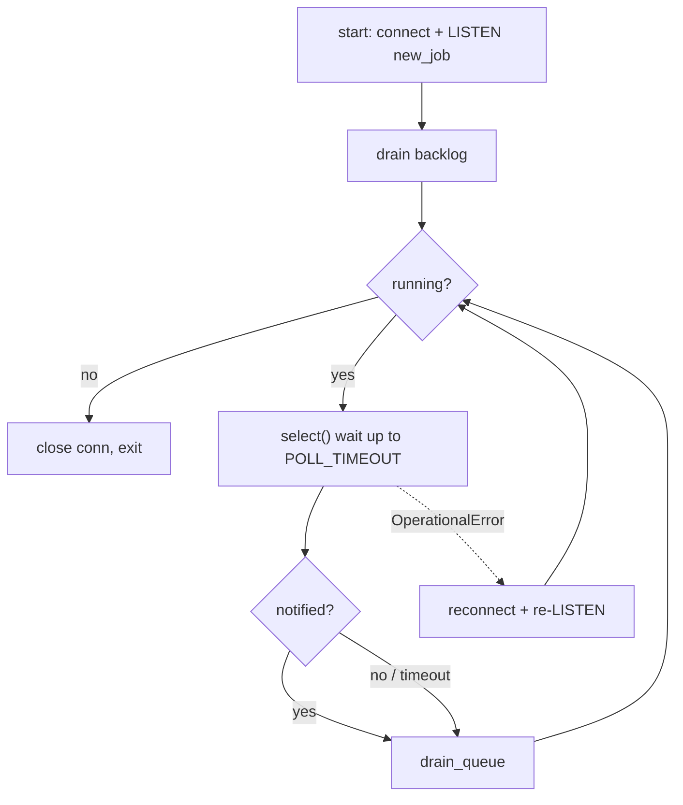
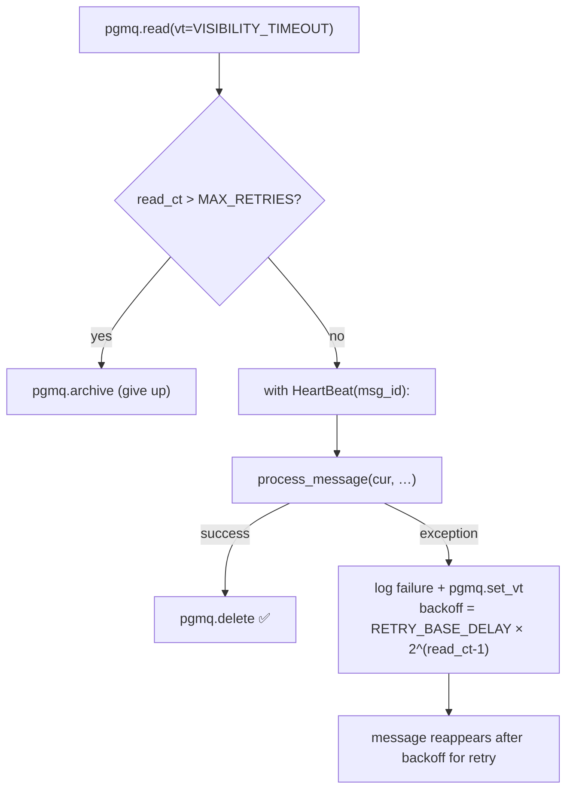
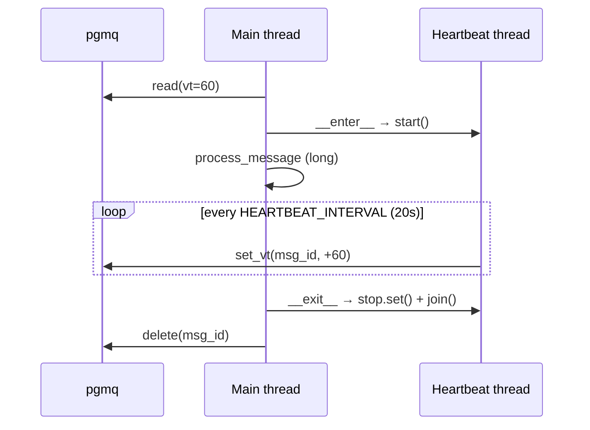
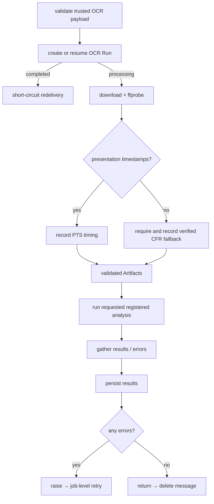
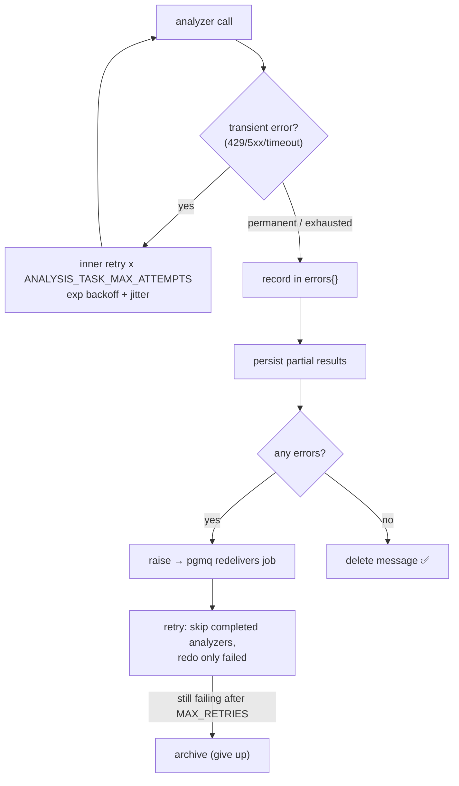

# Worker Architecture

The worker is a background service that consumes Media Processing jobs from a
Postgres-backed queue (**pgmq**) and persists durable analysis runs. The first
vertical slice accepts OCR-only jobs and establishes an idempotent OCR Run plus
validated media timing before any paid provider call. It has no HTTP surface.

---

## 1. High-level system flow

```mermaid
flowchart LR
    FE["Frontend"] -->|upload video| ST["Supabase Storage<br/>(private bucket)"]
    FE -->|enqueue_job(payload)| Q["pgmq: jobs queue"]
    Q -->|NOTIFY new_job| W["Worker(s)"]
    W -->|read / heartbeat / delete| Q
    W -->|download video| ST
    W -->|OCR analysis| API["External AI APIs"]
    W -->|persist results| DB["Postgres"]
```

- The frontend uploads the video to a **private** Storage bucket and calls the
  `enqueue_job(payload)` SQL function, which does `pgmq.send('jobs', payload)`.
- An `AFTER INSERT` trigger on the queue table fires `pg_notify('new_job', …)`.
- Workers `LISTEN` on that channel and drain the queue when notified.

---

## 2. Directory structure

```
worker/
├── app/                     # worker runtime & job orchestration
│   ├── main.py              # entry point: LISTEN/NOTIFY loop, reconnect, shutdown
│   ├── worker_queue.py      # drain_queue: read → process → delete/archive
│   ├── heartbeat.py         # HeartBeat: extends message visibility while working
│   ├── processor.py         # process_message: parse → preprocess → analyze → persist
│   ├── schemas.py           # JobPayload (pydantic) — validated job contract
│   └── errors.py            # compatibility exports for shared failure types
├── config/                  # configuration & infrastructure
│   ├── settings.py          # env vars + logger
│   ├── errors.py            # shared TransientError / PermanentError
│   └── connection.py        # psycopg2 connection factory (autocommit)
├── analyzer/                # video analysis domain
│   ├── types.py             # Artifacts, Frame (immutable dataclasses)
│   ├── video_preprocessor.py# VideoPreprocessor: video → Artifacts
│   └── video_analyzer.py    # VideoAnalyzer: registered analysis tasks
├── models/                  # model benchmarks (excluded from Docker image)
├── Dockerfile
└── pyproject.toml
```

**Dependency direction:** `app` → `analyzer` → `config`. `config` never imports
from `app` or `analyzer`. Cross-package imports are **absolute**
(`from config.settings import ...`); intra-package imports are relative
(`from .heartbeat import ...`).

---

## 3. The main loop (`app/main.py`)



- Uses **LISTEN/NOTIFY** for low-latency wakeups, with a `POLL_TIMEOUT` fallback
  so nothing is missed if a notification is dropped.
- On a lost DB connection it reconnects and re-`LISTEN`s.
- `SIGTERM`/`SIGINT` flip a `running` flag for graceful shutdown; the current
  drain finishes before exit.

---

## 4. Job lifecycle (`app/worker_queue.py`)



- `pgmq.read` makes a message **invisible** for `VISIBILITY_TIMEOUT`, it is **not**
  a pop. The message is only removed on `pgmq.delete` after success.
- If processing raises, the failure is logged (with a full traceback when `DEBUG`
  is on) and the message's visibility is reset via `pgmq.set_vt` to an
  **exponential backoff** — `RETRY_BASE_DELAY × 2^(read_ct-1)` seconds — so the
  retry is delayed and spaced out rather than waiting the full
  `VISIBILITY_TIMEOUT`. Delivery is **at-least-once**.
- `read_ct > MAX_RETRIES` archives poison messages so they don't loop forever.

---

## 5. Heartbeat (`app/heartbeat.py`)

Video analysis can run far longer than `VISIBILITY_TIMEOUT`. Without action, the
message would reappear mid-job and be processed twice. The `HeartBeat` context
manager runs a **background thread** that periodically extends the visibility
window via `pgmq.set_vt`.



Key design points:

- **Separate DB connection** — psycopg2 connections aren't safe for concurrent
  use across threads, so the heartbeat opens its own.
- **`set_vt` is absolute** (`now + offset`), not additive — the deadline slides
  forward, it never accumulates.
- **Renewal offset > interval** (`VISIBILITY_TIMEOUT` 60s renewed every 20s) gives
  ~3 heartbeats of headroom, so a late/failed renewal doesn't drop the job.
- **Daemon thread** — never keeps the process alive on shutdown.
- On a real crash the heartbeat dies too; the job reappears after the window and
  is retried.

---

## 6. OCR Run intake and Media Processing (`app/processor.py`)



### Establish identity and timing before analysis
The caller supplies stable Review Request, Ad Creative, and OCR Run identifiers.
The worker upserts the Ad Creative identity, creates or resumes the OCR Run, and
does not repeat a completed run. `VideoPreprocessor.prepare()` then streams the
private video to temporary storage and uses `ffprobe` to reject undecodable,
over-60-second, or invalid media before constructing an analysis provider.

Presentation timestamps are authoritative, including for variable-frame-rate
media. Frame-index timing is allowed only when timestamps are absent and ffprobe
reports matching positive average and real frame rates; that fallback is
recorded explicitly in `Artifacts`.

### Analysis registry and concurrency
`app.schemas.SUPPORTED_ANALYSES` is the worker-owned admission registry. The
current trusted contract contains exactly one requested analysis, `ocr`.
`_run_analysis` still uses a thread executor so later approved analyses can run
concurrently without changing the orchestration boundary.

**Thread-safety:** every analyzer only **reads** the shared immutable `Artifacts`
(paths, frames, metadata). Concurrent reads don't race. Analyzers hold no shared
mutable state and open their own file handles from the shared paths.

`VideoAnalyzer` exposes its tasks via the `@analysis_task` decorator and
`analysis_tasks()`, which discovers every tagged method — so adding an analyzer
is just adding a decorated method.

---

## 7. Two-layer retry model

Two independent retry layers guard against different failures — **both are kept**.



| Layer | Scope | Catches | Mechanism |
|-------|-------|---------|-----------|
| **Inner** | one analyzer call | transient API blips (429, 5xx, timeout) | `_with_retry` + exponential backoff/jitter, only on `TransientError` |
| **Outer** | whole job | process crash/OOM, prep failure, exhausted inner retries, poison messages | pgmq redelivery via `pgmq.set_vt` exponential backoff (`RETRY_BASE_DELAY × 2^(read_ct-1)`) + `read_ct`/`MAX_RETRIES` → archive |

- Inner retry recovers most failures instantly without redoing successful work.
- Outer retry is the only defense against a **dead process** (no in-code retry can
  run) and is the give-up brake for poison messages.
- With **persist-partial**, an outer retry skips already-completed analyzers, so
  it only redoes what actually failed.

---

## 8. Temp files & cleanup

- Each job runs inside a unique `tempfile.TemporaryDirectory(prefix="job_<id>_")`.
- All derived files (video, audio, frames) live under that `work_dir`.
- The `with` block deletes the whole directory on exit — **success or exception**.
- Unique-per-job dirs mean concurrent jobs never collide.
- Crash case: cleanup is skipped, but Railway restarts with a **fresh filesystem**;
  a startup sweep of stale `job_*` dirs is recommended as a backstop.
- Disk budget: `concurrent_jobs × (video + frames)` must fit the container disk.

---

## 9. Concurrency across jobs & scaling

Two axes, used together in production:

- **Replicas (process-level):** run N copies of the worker. pgmq's visibility
  timeout guarantees no two replicas read the same message — safe with zero code
  change. Primary scaling/resilience axis.
- **In-process concurrency (optional):** a bounded thread pool of jobs per replica
  for I/O efficiency. Adds shared-fate risks (memory/OOM, DB connections, rate
  limits) — add only when volume justifies it.

**Hard ceiling:** `replicas × jobs_per_replica × requested analyses` simultaneous API calls must
stay under external rate limits and the Supabase connection budget
(≈ `1 + 2 × in-flight jobs` connections per replica). Route `DATABASE_URL`
through the Supabase transaction pooler under load.

### Deployment (Railway)
- Deploy as a background service (no public port).
- Scale via **Settings → Replicas**; each replica pulls independently.
- Graceful shutdown: Railway sends `SIGTERM`; the `running` flag drains the
  current job. Rely on Railway auto-restart (no HTTP healthcheck possible).
- Tag logs with `RAILWAY_REPLICA_ID` since logs are aggregated across replicas.

---

## 10. Configuration (`config/settings.py`)

| Setting | Default | Purpose |
|---------|---------|---------|
| `DATABASE_URL` | — (required) | Postgres/Supabase connection string |
| `DEBUG` | `False` | enables `DEBUG`-level logs and failure tracebacks (`exc_info`); set via `1`/`true`/`yes` |
| `QUEUE_NAME` | `jobs` | pgmq queue name |
| `CHANNEL_NAME` | `new_job` | LISTEN/NOTIFY channel |
| `VISIBILITY_TIMEOUT` | `60` | seconds a read message stays invisible |
| `HEARTBEAT_INTERVAL` | `20` | seconds between visibility renewals (< timeout) |
| `POLL_TIMEOUT` | `5` | max seconds to block in `select()` |
| `MAX_RETRIES` | `3` | job-level attempts before archiving |
| `ANALYSIS_TASK_MAX_ATTEMPTS` | `3` | inner per-analyzer total attempts (1 initial + 2 retries) |
| `RETRY_BASE_DELAY` | `5` | base seconds for outer-layer backoff (`× 2^(read_ct-1)`) on job failure |
| `SUPABASE_URL` | — (required for media) | Storage project URL |
| `SUPABASE_SERVICE_ROLE_KEY` | — (required for media) | private Storage authentication |
| `DOWNLOAD_TIMEOUT` | `60` | Storage request timeout in seconds |
| `FFPROBE_TIMEOUT` | `30` | media inspection timeout in seconds |

---

## 11. Job payload contract (`app/schemas.py`)

```jsonc
{
  "request_id": "uuid",                    // stable Review Request
  "ad_creative_id": "uuid",                // stable source identity
  "ocr_run_id": "uuid",                    // idempotency and rerun identity
  "requested_analyses": ["ocr"],            // validated against worker registry
  "bucket": "videos",                      // Storage bucket holding the inputs
  "video_path": "path/to/video.mp4",       // video object key within the bucket
  "product_imgs_folder_path": "path/imgs", // retained legacy field
  "logo_imgs_folder_path": "path/logos"    // retained legacy field
}
```

The six identity, analysis, and source fields are required. The two image-folder
fields are optional legacy inputs retained for producer compatibility.

Validated with pydantic (`JobPayload.model_validate`). A structurally invalid
payload fails identically on every retry and is archived after `MAX_RETRIES`
(poison-message handling).

---

## 12. Run locally

```bash
# from worker/
uv run python -m app.main

# multiple replicas via docker compose
docker compose up --scale worker=3
```
